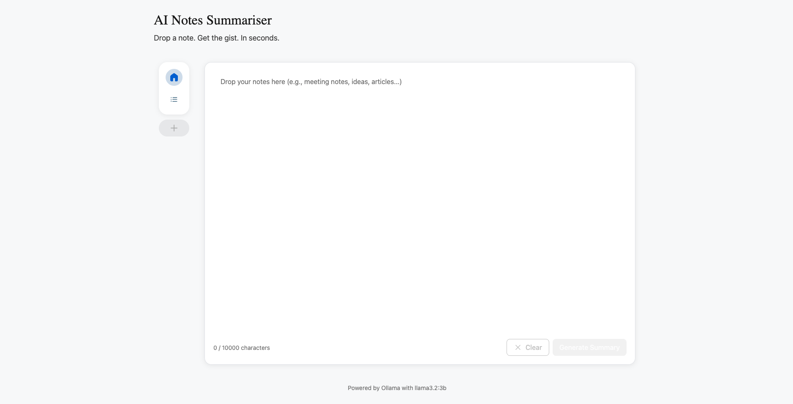
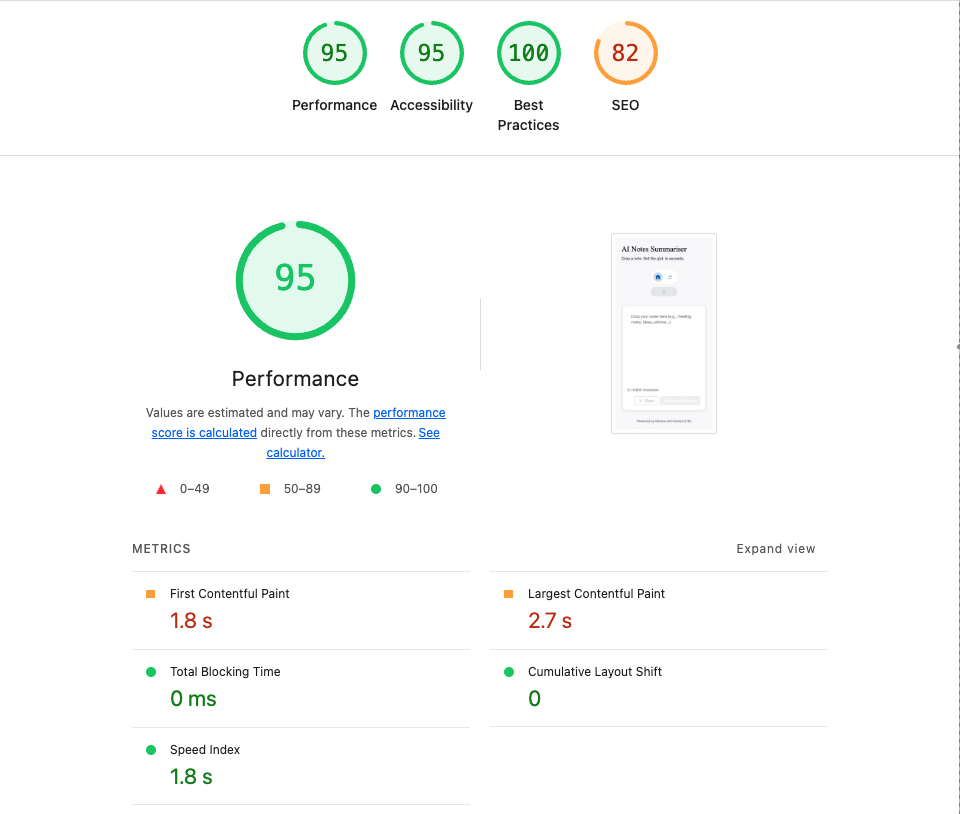

# AI Notes Summarizer ✨



A demo-quality web application that allows users to capture free-form notes and generate concise AI-powered summaries using Ollama.


## 📹 Demo Video

[](https://www.loom.com/share/a1f0a9c8efa744b5a5dae93b82ba9ab8)

*Click to watch the full application demo*


## ✨ Core Features

- **AI-Powered Summarization** - Generate concise summaries from free-form notes
- **Note History** - View all past summaries and original notes
- **Real-time Generation** - Fast AI processing (~2-3 seconds)
- **Clean UI** - Intuitive, polished interface built with React + Tailwind
- **Fully Dockerized** - One command to start everything


## 🚀 Quick Start

### Prerequisites

- Docker and Docker Compose installed
- At least 4GB of available RAM
- Modern web browser

### Installation & Running

**1. Clone and navigate to the project:**
```bash
git clone https://github.com/HsinChenHazel/maincode-ai-notes-summariser.git
cd maincode-ai-notes-summariser
```

**2. Start all services:**
```bash
docker-compose up --build -d
```

This single command will:
-  Pull and start Ollama service
-  Download the llama3.2:3b model (~2GB, first time only)
-  Build and start the backend API
-  Build and start the frontend

**3. Access the application:**

Wait 2-3 minutes for the model to download (first time only), then open:

- **Frontend:** http://localhost:3000
- **Backend API:** http://localhost:5001
- **Health Check:** http://localhost:5001/health

**4. Stop the services:**
```bash
docker-compose down
```

To remove all data (notes and models):
```bash
docker-compose down -v
```

### Optional: Manual Model Pull

If you want to ensure the model is ready before using the app:
```bash
docker exec -it ai-notes-ollama ollama pull llama3.2:3b
```


## 🛠️ Built With

### Frontend


### Backend


### AI & Infrastructure


## ✏️ Architecture

### System Overview

```
┌─────────────────┐      HTTP REST       ┌─────────────────┐
│    Frontend     │ ◄──────────────────► │     Backend     │
│     (React)     │                      │    (Express)    │
│   Port 3000     │                      │    Port 5001    │
└─────────────────┘                      └────────┬────────┘
                                                  │
                                                  │ HTTP REST
                                                  │
                                           ┌──────▼──────┐
                                           │   Ollama    │
                                           │ Port 11434  │
                                           └─────────────┘
```

### Technology Details

**Frontend**
- React 18 with TypeScript
- Vite for fast development and building
- Tailwind CSS for styling
- Modern React hooks for state management
- Nginx for production serving

**Backend**
- Node.js with Express
- TypeScript for type safety
- JSON file-based storage (simple persistence)
- RESTful API design

**AI Backend**
- Ollama with llama3.2:3b model
- REST API integration
- Auto-download model on first use
- Structured output (title + summary generation)
- Robust JSON parsing with multiple fallback strategies

**Infrastructure**
- Docker Compose for orchestration
- Multi-container setup (frontend, backend, ollama)
- Docker networks for service isolation
- Named volumes for data persistence

### API Endpoints

#### `POST /api/notes`
Create a new note and generate AI summary.

**Request:**
```json
{
  "content": "Your note content here..."
}
```

**Response:**
```json
{
  "note": {
    "id": "uuid",
    "content": "Your note content here...",
    "title": "Generated Title",
    "summary": "AI-generated summary...",
    "createdAt": "2024-01-01T00:00:00.000Z"
  }
}
```

#### `GET /api/notes`
Retrieve all stored notes.

#### `GET /api/notes/:id`
Retrieve a specific note by ID.

#### `GET /health`
Health check endpoint that reports Ollama connection status.


## 📊 Performance



- **Performance:** 95/100
- **Accessibility:** 95/100
- **Best Practices:** 100/100
- **SEO:** 82/100


## 🎨 Design

View the complete design system and component specifications:
- **[Figma Design File](https://www.figma.com/design/HNf3tdmmzFiP8YHTwXiVSX/Note-Summary?node-id=0-1&t=f6IfH9mgvYlPthQh-1)**

Includes wireframes, component specifications, and design tokens.


## 🎯 Key Design Decisions & Trade-offs

### 1. JSON Storage vs Database

**Decision:** JSON file-based storage

**Rationale:**
- Simple setup with no database dependencies
- Easy to inspect and reset data
- Sufficient for demo scenarios

**Trade-offs:**
- Would need PostgreSQL/SQLite for production
- No concurrent write safety
- Limited query capabilities

### 2. Multi-Container Architecture

**Decision:** Separate containers for frontend, backend, and Ollama

**Rationale:**
- Service isolation and independent scaling
- Clear separation of concerns
- Each service can be developed/deployed independently

**Trade-offs:**
- More complex than single container
- Requires Docker Compose
- Slight network overhead

### 3. Model Selection: llama3.2:3b

**Decision:** Use llama3.2:3b model

**Rationale:**
- **Optimal balance** of quality and speed
- Runs on consumer hardware (4GB+ RAM)
- Fast inference (~2-3 seconds)
- Excellent for summarization tasks
- Small download size (~2GB)

**Trade-offs:**
- Larger models (7B+) would give better quality but need more resources
- Smaller models (1B) would be faster but lower quality

**Why not alternatives?**
- GPT models require API keys and external dependencies
- Mistral 7B is larger and slower, overkill for this use case
- Llama 3.2 has better instruction following than Phi models

### 4. Non-streaming Responses

**Decision:** Complete responses (non-streaming)

**Rationale:**
- Simpler implementation
- Adequate for short summaries (~2-3 second wait)
- Easier error handling
- Good for demo purposes

**Trade-offs:**
- Streaming would show real-time progress
- User doesn't see generation in progress
- Can be added later as enhancement

### 5. React + TypeScript

**Decision:** React 18 with TypeScript

**Rationale:**
- Mature ecosystem with excellent tooling
- Strong type safety with TypeScript
- Large community and resources
- Component reusability

### 6. Tailwind CSS

**Decision:** Tailwind utility-first CSS framework

**Rationale:**
- Rapid development without custom CSS
- Consistent design system
- Small production bundle (with purging)
- Excellent responsive utilities


## 📋 Assumptions

1. Ollama runs in Docker (not local installation)
2. Docker and Docker Compose are installed
3. Modern browser with ES6+ support
4. No authentication required (demo only)
5. Plain text notes (no markdown in input)
6. Single-user scenarios
7. Ports 3000, 5001, and 11434 are available
8. Backend can communicate with Ollama via Docker network


## 🚀 Future Improvements

### Short-term (1-2 days)
- Responsive design for mobile devices
- Note deletion with confirmation
- Note editing capability
- Markdown support in notes/summaries
- Search and filter for past notes
- Dark mode toggle

### Medium-term (1 week)
- Database migration (PostgreSQL/SQLite)
- User authentication (JWT)
- Tags and categories
- Multiple model selection
- Custom summarization prompts
- Rate limiting
- Response caching

### Long-term (1+ months)
- Streaming responses with real-time updates
- Offline support (service workers)
- Mobile app (React Native)
- Cloud deployment (AWS/GCP/Azure)
- Advanced AI features (sentiment analysis, key points extraction)
- Collaboration features
- Integration with Notion, Obsidian, etc.
- Voice input
- OCR for images


## 🐛 Troubleshooting

### Model Not Loading

Manually pull the model:
```bash
docker exec -it ai-notes-ollama ollama pull llama3.2:3b
```

Verify it's loaded:
```bash
docker exec -it ai-notes-ollama ollama list
```

### Backend Can't Connect to Ollama

Check service health:
```bash
docker-compose ps
docker-compose logs ollama
```

Test Ollama directly:
```bash
curl http://localhost:11434/api/tags
```

### Frontend Can't Connect to Backend

Verify backend is running:
```bash
curl http://localhost:5001/health
docker-compose logs backend
```

Check browser console for CORS errors.

### Port Conflicts

Modify `docker-compose.yml` to use different ports:
```yaml
ports:
  - "3001:80"      # Frontend
  - "5002:5000"    # Backend
  - "11435:11434"  # Ollama
```

### Container Won't Start

View logs:
```bash
docker-compose logs [service-name]
```

Rebuild from scratch:
```bash
docker-compose down -v
docker-compose build --no-cache
docker-compose up
```

### Slow Performance

Check system resources:
```bash
docker stats
```

Ensure no other heavy processes are running. Consider using a smaller model if needed.


## 📝 License

This project was created as a takehome assignment for maincode interview process.